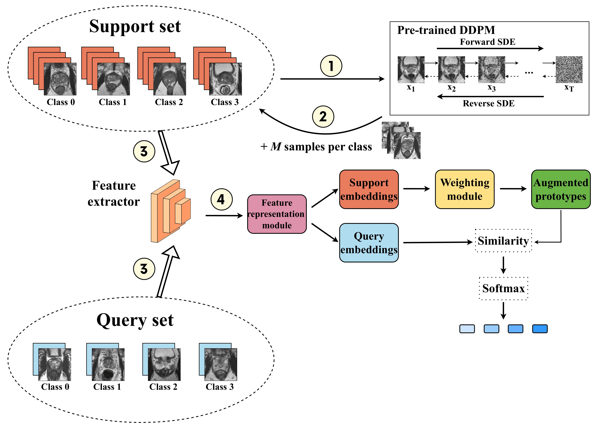

# Seeing More with Less: Meta-Learning and Diffusion Models for Tumor Characterization in Low-data Settings 
Official code for "Seeing More with Less: Meta-Learning and Diffusion Models for Tumor Characterization in Low-data Settings". Accepted at 3rd Workshop on Cancer Prevention, detection, and intervenTion (CaPTion) in conjuction with MICCAI 2024. This code is based on [Score SDE](https://openreview.net/forum?id=PxTIG12RRHS), by Yang Song et al., [Prototypical Network](https://papers.nips.cc/paper_files/paper/2017/hash/cb8da6767461f2812ae4290eac7cbc42-Abstract.html) by Snell et al., [CovNet](https://openaccess.thecvf.com/content_CVPR_2019/papers/Wertheimer_Few-Shot_Learning_With_Localization_in_Realistic_Settings_CVPR_2019_paper.pdf) by Wertheimer and Hariharan, and [DeepBDC](https://openaccess.thecvf.com/content/CVPR2022/papers/Xie_Joint_Distribution_Matters_Deep_Brownian_Distance_Covariance_for_Few-Shot_Classification_CVPR_2022_paper.pdf) by Xie et al.



## Run experiment 
To run an experiment, modify the run.sh file accordingly. Job launch example:
```
sbatch --job-name exp1 -n 16 --gpus 2 -p long -o out.out -e err.err run.sh
```

## Citation
```
@InProceedings{10.1007/978-3-031-73376-5_5,
author="Pachetti, Eva
and Colantonio, Sara",
editor="Ali, Sharib
and van der Sommen, Fons
and Papie{\.{z}}, Bart{\l}omiej W{\l}adys{\l}aw
and Ghatwary, Noha
and Jin, Yueming
and Kolenbrander, Iris",
title="Seeing More with Less: Meta-learning and Diffusion Models for Tumor Characterization in Low-Data Settings",
booktitle="Cancer Prevention, Detection, and Intervention",
year="2025",
publisher="Springer Nature Switzerland",
address="Cham",
pages="48--58",
isbn="978-3-031-73376-5"
}
```

